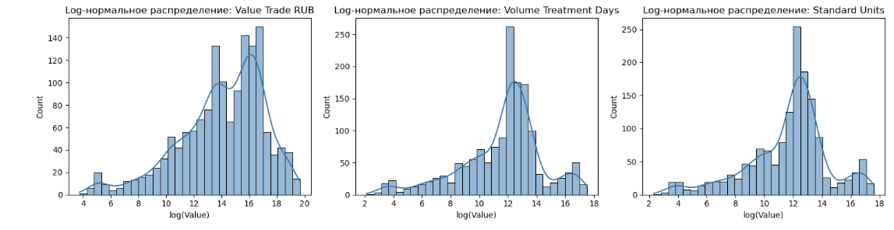

# SNF Test

## Описание

Проект посвящён анализу рынка гипотензивных препаратов (сартанов, ARB) за период 2010–2014 годов. Цель работы — сформировать автоматизированный шаблон в Excel для расчёта ключевых рыночных показателей (Sales, Incremental Sales, Sales Growth, Market Share) с возможностью выбора периода анализа (год, месяц) и провести дополнительное исследование: оценить привлекательность рынка, изучить ценовую сегментацию, а также проанализировать взаимосвязь между ценами препаратов и их долями рынка.

## Введение

Для выполнения задания использовал Excel (включая Power Query, насколько это возможно на macOS) и Python для дополнительного анализа и визуализаций. Поскольку версия Excel для macOS не поддерживает Power Pivot и полноценное моделирование данных, некоторые функции пришлось реализовать вручную.

## Data Preprocessing

На этапе предварительной обработки данных были выполнены следующие шаги:

**Проверка пропусков**

Все ключевые столбцы (name, measures, year, month, value) проверены на наличие пропусков. Пропущенных значений не обнаружено.

**Проверка полноты периодов**

Данные охватывают все месяцы за период 2010–2014 гг., пропусков по месяцам или годам не найдено.

**Проверка отрицательных значений**

По бизнес-логике значений меньше нуля быть не должно. Так и оказалось.

**Анализ распределений и выбросов**

Для каждой метрики (Value Trade RUB, Volume Treatment Days, Standard Units) построены гистограммы.
Данные имеют распределение, близкое к логнормальному, что было подтверждено после логарифмирования значений.

Обнаружены выбросы - редкие наблюдения с экстремально высокими значениями продаж - это могут быть либо сезонные всплески, либо уникальные акции.

Эти шаги позволили убедиться в качестве данных и определить подходы к дальнейшему анализу.

