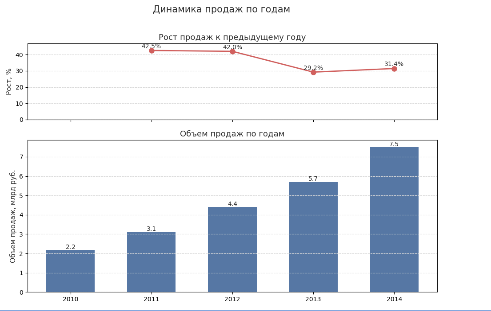
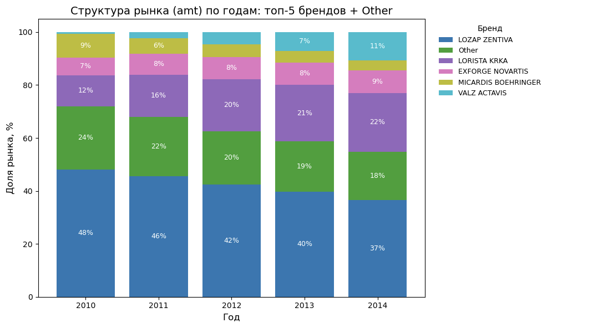

# SNF Test

## Описание

Проект посвящён анализу рынка гипотензивных препаратов (сартанов, ARB) за период 2010–2014 годов. Цель работы — сформировать автоматизированный шаблон в Excel для расчёта ключевых рыночных показателей (Sales, Incremental Sales, Sales Growth, Market Share) с возможностью выбора периода анализа (год, месяц) и провести дополнительное исследование: оценить привлекательность рынка, изучить ценовую сегментацию, а также проанализировать взаимосвязь между ценами препаратов и их долями рынка.

## Введение

Для выполнения задания использовал Excel (включая Power Query, насколько это возможно на macOS) и Python для дополнительного анализа и визуализаций. Поскольку версия Excel для macOS не поддерживает Power Pivot и полноценное моделирование данных, некоторые функции пришлось реализовать вручную.

## Data Preprocessing

На этапе предварительной обработки данных были выполнены следующие шаги:

**Проверка пропусков**  
Все ключевые столбцы (name, measures, year, month, value) проверены на наличие пропусков. Пропущенных значений не обнаружено.

**Проверка полноты периодов**  
Данные охватывают все месяцы за период 2010–2014 гг., пропусков по месяцам или годам не найдено.

**Проверка отрицательных значений**  
По бизнес-логике значений меньше нуля быть не должно. Так и оказалось.

**Анализ распределений и выбросов**  
Для каждой метрики (Value Trade RUB, Volume Treatment Days, Standard Units) построены гистограммы.
Данные имеют распределение, близкое к логнормальному, что было подтверждено после логарифмирования значений.

Обнаружены выбросы - редкие наблюдения с экстремально высокими значениями продаж - это могут быть либо сезонные всплески, либо уникальные акции.

Эти шаги позволили убедиться в качестве данных и определить подходы к дальнейшему анализу.

## Ad-hoc Request #1. Calculations in Excel

### Проблема горизонтальных структур и Power Query

Для выполнения расчётов данные были трансформированы из горизонтальной структуры в вертикальную. Основным вызовом стал исходный формат данных, однако задача была решена с использованием Power Query. Через функцию Unpivot таблица была приведена к удобному для анализа виду, где выделены ключевые поля: полное название препарата (конкатенация «Название препарата + Название компании»), год, месяц и квартал. Такой подход позволяет автоматически обновлять все расчёты при обновлении исходного источника данных.

### Отступление: SUMIFS vs SUMPRODUCT

При расчётах с множественными условиями в Excel часто используют функцию SUMIFS, так как она интуитивно понятна и проста в применении. Однако при более гибких сценариях стоит обратить внимание на SUMPRODUCT, которая предоставляет расширенные возможности. Именно SUMPRODUCT в основном использовалась мной в ходе вычислений.

**Преимущества SUMPRODUCT:**  
Гибкость условий. SUMPRODUCT позволяет задавать логические выражения напрямую, комбинировать условия с использованием операций (*, +) без необходимости писать вложенные формулы.

Работа с массивами. SUMPRODUCT умеет работать с массивами данных, что удобно для сложных аналитических расчётов.

Универсальность. Этой функцией можно решать не только задачи суммирования, но и выполнять вычисления наподобие условного подсчёта, средних значений и др.

Несмотря на удобство, многие забывают про SUMPRODUCT, предпочитая SUMIFS. Однако в сложных аналитических задачах SUMPRODUCT зачастую оказывается более мощным инструментом, особенно если необходимо использовать сложные условия или работать с массивами напрямую.

### Реализация расчётов

После подготовки данных особых сложностей не возникло. Все метрики рассчитываются с помощью формул Excel, которые обращаются к ранее созданной вертикальной таблице. Такой подход позволяет гибко агрегировать данные и оперативно обновлять результаты.

### User Interface

**Выбор метрики**  
Я немного модернизировал интерфейс, добавив поле выбора метрики (measure). Это решение позволяет экономить пространство и делает отчёт более компактным, без излишнего увеличения его масштаба.

**EUR / RUB**  
В последней версии Excel для macOS поддерживаются актуальные котировки валют. Поле Euro exchange rate автоматически подгружает текущее значение курса. Однако для более точного анализа правильнее использовать исторические значения — средний курс за конкретный месяц или курс на момент закрытия торгов в последний рабочий день месяца. В Samsung мы применяли именно такой подход.

### Завершение первого задания

На этом выполнение первого задания подходит к концу. В целом процесс не вызвал серьёзных трудностей: были проведены базовые проверки данных, выполнена трансформация структуры таблицы в удобный для анализа формат, а также аккуратно прописаны формулы для расчёта ключевых метрик. Такой подход обеспечивает корректность итоговых данных и простоту их обновления.

По-хорошему, для более гибкого и масштабируемого решения стоило бы реализовать расчёты в Power Pivot с использованием DAX-мер, что является более устойчивым и универсальным подходом. Однако, как уже упоминалось ранее, в версии Excel для macOS Power Pivot не поддерживается.

## Ad-hoc Request #2. Market Attractiveness

### Анализ динамики

Рынок сартанов за 2010–2014 гг. показал впечатляющий рост: объём продаж увеличился более чем в 3,4 раза (с ≈2,2 млрд до ≈7,5 млрд руб.), что свидетельствует об активном расширении потребления и высокой востребованности класса ARB.

При этом темпы роста замедляются: после пиковых +42% в 2011–2012 гг. они опустились до +29% в 2013 г. и +31% в 2014 г. Это указывает на постепенное насыщение рынка и ужесточение конкуренции — сегмент остаётся привлекательным, но требует фокусировки на дифференциации продуктов и оптимизации затрат.

### Анализ конкурентов

По структуре рынка видно, что в 2010–2014 гг. доминировавший лидер — LOZAP ZENTIVA — утратил значительную долю: с почти 48 % в 2010 г. она опустилась до 37 % в 2014 г. В то же время LORISTA KRKA уверенно нарастила присутствие с 12 % до 22 %, а VALZ ACTAVIS вообще «выросла из нуля» (появившись в 2012 г.) до 11 % к концу периода.

Средние игроки — EXFORGE NOVARTIS и MICARDIS BOEHRINGER — держатся примерно на 7–9 % каждый, а категория Other (мелкие производители) потихоньку сокращается с 24 % до 18 %.

Выводы для привлекательности рынка:

Сегмент остаётся высококонцентрированным, но доля «лидера» снижается — это открывает окна возможностей для агрессивных новичков и «право на ошибку» у быстрорастущих брендов.

Рост долей LORISTA и появление VALZ свидетельствуют о том, что рынок всё ещё готов принимать новые, качественные продукты.

С другой стороны, давление со стороны сильных участников и уплотнение среднего сегмента усложняют стратегию входа — для успеха нужно чётко выстраивать бренд‑ и ценовую дифференциацию.

### Вывод

Рынок сартанов остаётся привлекательным благодаря устойчивому трёхкратному росту объёма за 2010–2014 гг. и всё ещё двузначным темпам прироста. При этом доминирующий лидер снижается в доле, а сильные «средние» игроки (LORISTA, VALZ) активно наращивают присутствие — это свидетельствует о возможностях для новых и дифференцированных предложений, но одновременно указывает на усиливающуюся конкуренцию и необходимость чёткой стратегии позиционирования.
